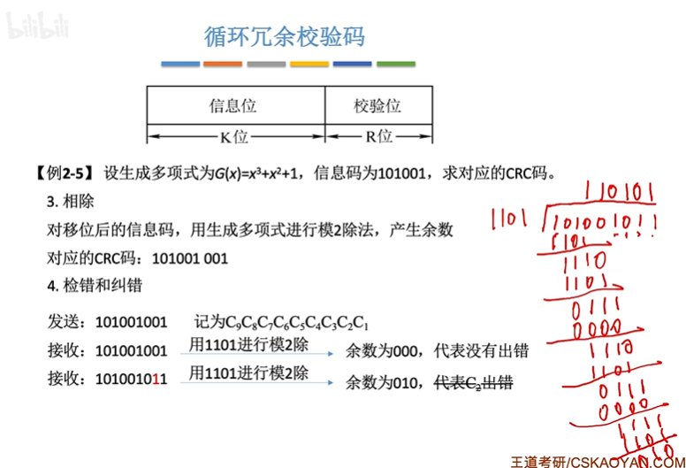

#  
- 数据链路层使用物理层提供的“比特传输服务”  

- 数据链路层为网络层提供服务，将网络层的IP数据报（分组）封装成帧，传输给下一个相邻节点的对等实体
- 逻辑链路：数据链路层需要基于“物理链路”，实现相邻节点之间逻辑上无差错的“数据链路（逻辑链路）”  

## 功能一 封装成帧(组帧)  

1.**帧定界**  
如何让接收方能够确定帧的界限

2.**透明传输**    
接收方要能够去除“帧定界”的附加信息，把帧“恢复原貌”  

#  
**字符计数法**  

在每个帧开头，用一个定长计数字段表示帧长;  
最大缺点：任何一个计数字段出错，都会导致后续所有帧无法定界  

**字节填充法**  
每个帧首部添加控制字符SOH，尾部添加控制字符EOT;  
为了避免歧义，可以添加转义字符ESC  

**零比特填充法(位填充法)**  
用一个特殊比特串“01111110”表示帧开始/结束  
为了避免歧义，发送方需要对帧的数据部分进行处理，每当遇到连续5个1，就填充一个0  
接受方需要对帧的数据部分进行逆处理  
HDLC协议和PPP协议使用零比特填充法

**违规编码法**  
曼彻斯特编码(IEEE标准)
上跳0下跳1，中必变，如果周期中间不跳变，则违规；
在帧的开头和结尾各插入一个时钟的违规信号；
*这种帧定界方式只适用于**物理层用曼彻斯特编码**的协议（如 IEEE 802.3 最早期的以太网）*

## 功能二 差错控制  

目标：发现并解决一个帧内部的位错

**解决方案一**

接收方发现比特错后丢弃帧，并通知发送方重传帧;

- 如何发现比特错？
  1. 奇偶校验码
     在整个校验码前加入一个奇偶校验位
     奇校验保证校验位＋信息位1为奇数  **1**1001101
     偶校验同理。偶校验所有信息位做异或运算产生校验位，发送方和接收方都可以用这个方法
  2. 循环冗余校验码
     思想：数据发送、接收方约定一个除数
     
     给一个信息码，左移R位(二项式最高次幂)然后与生成二项式相除，余数是CRC码。信息位与CRC码相拼得发送帧，接受的信息码与CRC码相除比对是否出错。

**解决方案二**

由接收方发现并纠正比特错误;

*海明码设计思路：将信息位分组进行偶校验->多个校验位*
n个信息位，k个校验位；共n+k位；
k个校验位可以表示2^k种状态  ->  即2^k>=n+k+1

计网应该不考这个，408会考

## 功能三四 可靠传输与流量控制  

**滑动窗口机制**

- 发送窗口WT：发送方当前允许发送的帧；
- 接收窗口WR：接收方当前允许接收的帧
  - 若收到接收窗口以外的帧，直接丢弃
  - 由接收方通过“确认机制”控制发送方的窗口向前滑动，从而实现“流量控制”

------

#### 停止-等待协议（S-W）

- **滑动窗口机制**

  WT与WR都是1

- **确认机制**

  发送方发送一个数据帧Data *i*，接收方收到后会返回一个确认帧ACK *i*（接收方确认无误后才会接收）

- **重传机制**

  若发送方超时(计时器)未收到ACK_i，则重传i号帧

  - 若确认帧丢失？

    发送方再一次发送数据帧，然后接收方收到重复帧；此时接收窗口已经滑动，帧序号落在接收窗口外：
    1.丢弃重复帧；2.返回重复帧的ACK

- **帧编号**

  要求 WT+WR<=2^n，n代表用n bit标识每个帧

------

#### 后退N帧协议（GBN）

- **滑动窗口机制**

  WT>1,WR=1

- **确认机制**

  接收方可以“累积确认”，即连续收到多个数据帧时，可以仅返回最后一个帧的ACK

- **重传机制**

  - 若数据帧丢失？

    所发送的数据帧的下一帧继续发送时，落到接收窗口以外
    接收方拒绝接受该帧，并返回最后一个正确帧的ACK，然后发送窗口滑动
    此时重传i帧及其之后的所有帧
    

    为什么叫“后退N帧协议”？

    - 原本已经发送了一号帧，但是因为0号丢失、后退到0号帧重新发送
      这样即可实现“流量控制”

- **帧编号**

  要求 WT+WR<=2^n，n代表用n bit标识每个帧

GBN的特殊规则

- 关于确认帧：接收方可以“累积确认”，即连续收到多个数据帧时，可以仅返回最后一个帧的ACK
- 关于超时重传：若发送方超时未收到ACK_i，则重传i号帧及其之后的所有帧

------

#### 选择重传协议（SR）

- **滑动窗口机制**

  WT>1,WR>1

- **确认机制**

  发送方发送一个数据帧Data *i*，接收方收到后会返回一个确认帧ACK *i*（接收方确认无误后才会接收）；SR协议不支持累积确认，必须一帧一确认

- **重传机制**

  若发送方超时(计时器)未收到ACK_i，则重传i号帧

- **帧编号**

  要求 WT+WR<=2^n，n代表用n bit标识每个帧
  要求WR<=WT,即接收窗口不大于发送窗口

*SR的特殊规则*

- 否认帧：NAK_i
  若接收方收到i号帧，但检测出i号帧有差错，需要丢弃该帧并给发送方返回否认帧NAK_i
- 请求重传
  若发送方收到NAK_i，则重传i号帧

**若不满足WT+WR<=2^n**，会导致发送方和接收方无法正确判别重复帧。

------

#### 三种协议的信道利用率？

先不看

## 功能五 介质访问控制  

介质访问控制(Medium Access Control,MAC):多个节点共享一个“总线型”广播信道时，可能发生“信号冲突”；

#### 信道划分

- **时分复用 TDM**

  - 将时间分为等长的TDM帧，每个TDM帧又分为等长的m个时隙，将m个时隙分为m对用户使用

  - 缺点：

    1. 每个节点最多只能分配到信道总带宽的1/m；
    2. 如果某节点暂不发送数据，会导致被分配的时隙闲置，信道利用率低

  - 如何解决上述缺点？

    可统计每个节点对信道的使用需求，动态按需分配时隙

- **统计时分复用 STDM** 又称异步时分复用

  - 如果需要时，一个节点可以在一段时间内获得所有的信道带宽资源
  - 如果某节点暂不发送数据，可以不分配“时隙”，信道利用率更高

- **频分复用 FDM**

  - 将信道的总频带划分成多个子频带，每个子频带作为一个子信道
  - 优点：各节点可同时发送信号，充分利用了信道带宽
    缺点：FDM技术只能用于*模拟信号*(有频率的概念)的传输

- **波分复用 WDM** 光的频分复用

  - 将各节点发出的不同波长的光信号“复合”后传输到光纤上
    *光信号的频带范围非常大*

- **码分复用 CDM**

  1. 给各节点分配专属码片序列

     - 码片序列包含m个码片，可看做m维向量（m维向量的分量通常取1/-1）
     - 要求各节点的m维向量必须相互正交
     - 相互通信的各节点知道彼此的码片序列

  2. 发送方如何发送数据

     - 节点发出m个信号值与码片序列相同，表示比特1
     - 相反表示比特0

  3. 信号在传输过程中叠加

     - 本质是多个m维向量的加法

  4. 接收方如何接收数据

     - 接收方收到的是叠加信号，需要从中分离出个发送方的数据
     - 叠加信号与发送方的码片序列作规格化内积 -> 结果为1表示比特1，结果为-1表示比特0

     

------

#### 随机访问

- **ALOHA协议**

  - *纯ALOHA*

    如果准备好数据帧，就立刻发送；
    等待接收方的ACK，超时的话随机等一段时间后尝试重传；
    **随机等一段时间**是因为两个冲突的帧等待相同时间后仍会冲突。

  - *时隙ALOHA*

    将时间分为若干时隙，如果准备好数据帧就在最近一个时隙把“数据帧”发送到信道上；
    等待ACK、随机时间重传；
    时隙大小固定＝传输一个最长帧所需时间

- **CSMA协议**      Carrier Sense Multiple Access 载波监听多路访问协议

  在ALOHA协议基础上提出改进：
  在发送数据前监听信道是否空闲，只有空闲时才会尝试发送。
  （节点的网络适配器安装载波监听装置）

  - 1-坚持CSMA
    信道不空闲则坚持监听

    ​	**优点：**信道利用率高，信道一旦空闲就可以被下一个节点利用
    	**缺点：**当多个节点都已准备好数据时，一旦信道空闲会有多个节点同时发送数
    	据，冲突概率大

  - 非坚持CSMA
    信道不空闲则放弃监听信道，随机推迟一段时间再尝试
    可以使各个节点错开发送数据，降低冲突概率

    ​	**缺点：**信道刚恢复空闲时，可能不会被立即利用，信道利用率降低

  - p-坚持CSMA
    有坚持监听的特性，但信道空闲时有p概率把数据帧发送到信道上
    1-p的概率会推迟一段时间再尝试发送

- **CSMA/CD协议**   Collision Detection

  用于早期的有线以太网（总线型）
  如同轴电缆连接多个节点组成的有线局域网、集线器连接多个节点组成的有线局域网

  - **协议要点**

    1. 先听后发，边听边发，冲突停发，随机重发

       具备1-坚持特性

       冲突停发时，如果是16次停发（k=16）则传输失败。
       放弃传送该帧，报告网络层

    2. 如何随机重发？**截断二进制指数退避算法** k<16
       随机等待一段时间 = r倍争用期，其中r是随机数

       1. 如果k<=10, 在[0, (2^k - 1)]区间随机取一个整数 r
       2. 如果k>10, 在[0, (2^10 - 1)]区间随机取一个整数 r

  - **争用期**＝2×最大单向传播时延（考虑距离最远的两个节点）

    - 若争用期内未发生冲突，就不可能再冲突
    - CSMA/CD没有ACK机制，若发送过程中未检测到冲突，就认为帧发送成功

  - **最短帧长**=2×最大单向传播时延×信道带宽

    ​	若收到的帧小于最短帧长，视为无效帧

  - **最长帧长**

    ​	规定最长帧长可防止某些节点一直占用信道

  - **以太网规定**

    - 最短帧长=64B；最长帧长＝1518B

  *CSMA/CD (接收方)*

  |       从信道收到一个帧       |
  | :--------------------------: |
  |      是否小于最短帧长？      |
  |      是否是发给自己的？      |
  |      CRC校验有无差错？       |
  | 接收，并把数据部分交给网络层 |

  ​

- **CSMA/CA协议**

  先跳过

- **令牌传递协议**

------

## 局域网与IEEE 802

**特点：**

1. 覆盖较小的地理范围
2. 较低的时延和误码率
3. 局域网内的各节点之间以帧为单位进行传输
4. 支持单播（一对一）、广播（一对全部）、多播（一对部分）

**分类：**

1. 有线局域网 LAN
2. 无线局域网 WLAN

##### 一、有线局域网

1）令牌环网 Token Ring

​	环形结构
	同轴电缆或双绞线
	令牌传递协议

2）以太网 802.3

- 同轴电缆以太网（早期）*物理层采用曼彻斯特编码*

  总线形
  同轴电缆（可用中继器连接多个同轴电缆网段）
  CSMA/CD协议

- 双绞线以太网 *10BaseT*

  - 用集线器连接

    物理上星形，逻辑上总线形
    双绞线
    CSMA/CD协议（半双工）

  - 用交换机连接

    物理上、逻辑上都是星形
    双绞线
    CSMA/CD协议 或 NULL

- 光纤以太网（用于扩大以太网覆盖范围）*10BaseF*

  点对点（用于中继器、集线器、交换机之间的传输，也就是说通常不会直接连接终端节点）
  光纤
  NULL（用两条光纤实现全双工通信）

**二、无线局域网**

- WiFi 802.11

  IEEE 802.11定义为星形（1个AP+N台移动设备）
  无线 Wireless
  CSMA/CA协议

**硬件架构**：

- 以太网适配器、WiFi网络适配器(无线网卡)内含RAM(帧缓冲)、ROM
- 发送窗口、接收窗口中那些帧在RAM中

*网络适配器要点*

1. 负责把帧发送到局域网
2. 负责从局域网接收帧
3. 需要根据介入的局域网类型，按照标准实现数据链路层+物理层功能

### 以太网与IEEE 802.3

1. 同轴电缆只能半双工

   *不同的网段用中继器连接，可以采用不同的标准*

2. 双绞线

   - 速率小于2.5Gbps可支持半双工或全双工
   - 速率≥2.5Gbps仅支持全双工光纤只支持全双工 

   

3. 光纤只支持全双工

------

#### V2标准的 以太网MAC帧

**记忆口诀：6 6 2 N 4，收发协数验**

 目的地址是接收方的MAC地址，有48bit (6字节)
 如果目的地址全为1 表示广播帧

类型指明网络层协议（IPv4、IPv6）；
而IEEE 802.3标准的以太网MAC帧没有类型字段，只有长度字段，用来标识数据的长度
指明协议的部分交给LLC层，V2标准没有LLC层

数据报太长就切片，太短就填充 46-1500